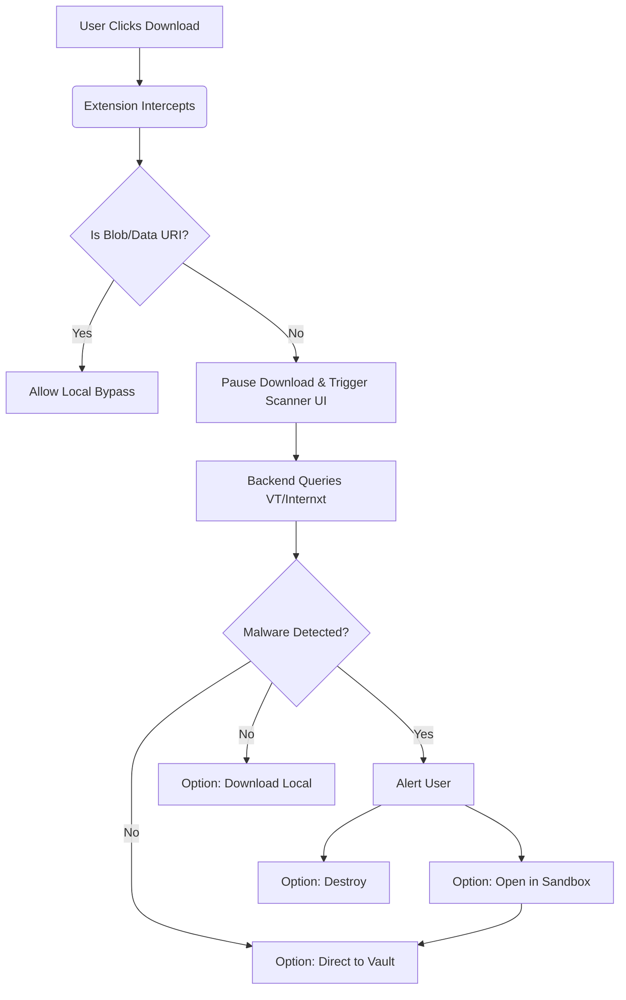
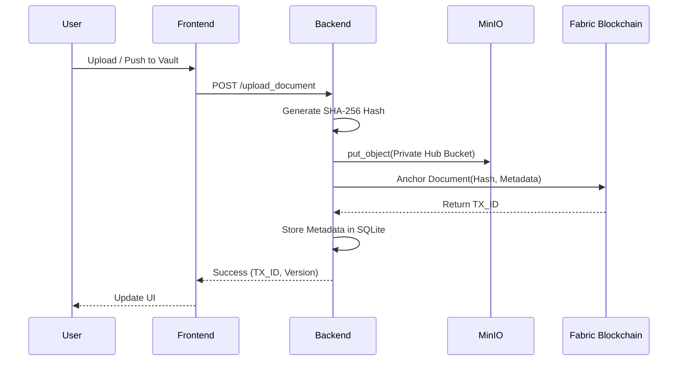
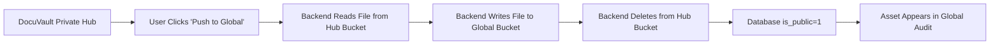

# 🛡️ DocuChain: Nexus Protocol V2.0

**Enterprise-Grade Document Verification, Anti-Malware Sandboxing, and Blockchain-Anchored Storage System.**

DocuChain is a comprehensive Zero-Trust architecture designed to secure organizational document workflows. It intercepts untrusted files at the browser level, sanitizes them via multi-engine malware scanning, isolates them in a secure sandbox, and anchors verified assets into an immutable Hyperledger Fabric blockchain ledger backed by private MinIO object storage.

---

## 📑 Table of Contents
1. [Core Architecture](#1-core-architecture)
2. [Detailed Component Breakdown](#2-detailed-component-breakdown)
3. [System Workflows (Flowcharts)](#3-system-workflows)
4. [Security & Zero-Trust Protocol](#4-security--zero-trust-protocol)
5. [API Reference](#5-api-reference)
6. [Deployment & Installation](#6-deployment--installation)

---

## 1. Core Architecture

DocuChain transitions from a public Web3 stack to a **Permissioned Enterprise Architecture**.

*   **Frontend Client:** React.js, Tailwind CSS, Vite. Features a highly interactive, futuristic "Glassmorphism" UI with real-time state management.
*   **Security Extension:** Manifest V3 Chrome Extension. Operates as a background service worker intercepting browser-level file I/O operations dynamically.
*   **Backend Server:** FastAPI (Python). High-performance asynchronous API handling authentication, document routing, and MinIO/Blockchain orchestration.
*   **Object Storage:** MinIO. Self-hosted, S3-compatible enterprise storage. Assets are segregated into Private Hub buckets (`hub_{network_id}`) and a Global Audit bucket (`global`).
*   **Blockchain Ledger:** Hyperledger Fabric. Permissioned ledger ensuring cryptographic immutability of document hashes (`SHA-256`) and transaction timestamps.

---

## 2. Detailed Component Breakdown

### 2.1 The Browser Security Extension
The extension acts as the first line of defense (The "Arise" Protocol).
*   **Pre-Download Interception:** Hooks into `chrome.downloads.onDeterminingFilename` to aggressively pause downloads before they hit the local disk.
*   **Multi-Engine Scanning:** Relays file buffers or download URLs to the backend, which queries VirusTotal and Internxt APIs for zero-day malware signatures.
*   **Scanner UI:** Displays a dynamic "Radar" interface (`scanner.html`) providing real-time feedback on the scanning process, taking over the browser's native download UI.
*   **Routing Options:** Users can send infected/suspicious files to the **Sandbox** (for isolated viewing) or bypass local storage entirely by pushing the asset directly to the **Enterprise Vault**.

### 2.2 DocuVault (Private Hubs)
A multi-tenant architecture allowing organizations to create isolated workspaces (Hubs).
*   **Role-Based Access:** Users can generate secure invite codes to add members to their private network hub.
*   **Asset Management:** Users can view their privately anchored assets, generate Temporary Access Tokens (24h expiry), or generate Offline Verification QR Codes.
*   **Asset Destruction:** Complete binary wipe from MinIO storage and SQLite metadata erasure for complete data sovereignty, restricted to the original uploader or network admin.

### 2.3 Global Audit Trail
A transparent ledger for cross-organization verification.
*   **Asset Promotion:** Users can push private assets to the Global Vault, moving the binary across MinIO buckets and updating its visibility flag.
*   **Immutability Score:** Displays the cryptographic integrity score (comparing the live MinIO binary hash against the Hyperledger Fabric anchor).
*   **Owner Sovereignty:** Only the original uploader retains the cryptographic authority to delete the asset from the Global Audit ledger.

---

## 3. System Workflows

### 3.1 Download Interception & Security Flow


### 3.2 Asset Anchoring & MinIO Storage Flow


### 3.3 Asset Promotion (Private to Global)


---

## 4. Security & Zero-Trust Protocol

1.  **Blob Bypass Architecture:** Prevents the extension from recursively intercepting its own sandbox blob URIs, avoiding memory leaks and infinite loops during sandbox-to-vault bridging.
2.  **JWT Session Management:** Stateless authentication using `Bearer` tokens. Endpoints enforce strict network-level isolation—a user in Network A cannot query or mutate Document IDs belonging to Network B.
3.  **Cryptographic Verification:** The `/verify` endpoint calculates the hash of the currently stored file and compares it against the initial hash permanently recorded on the Hyperledger Fabric ledger to detect physical tampering or bit rot.
4.  **Ephemeral Access Links:** Share links are generated as MinIO Pre-Signed URLs with a strict 24-hour expiration, preventing indefinite public exposure of sensitive documents.

---

## 5. API Reference (Core Endpoints)

*   `POST /upload_document`: Anchors a new document to the blockchain and MinIO.
*   `GET /history`: Retrieves the private DocuVault ledger for the user's current network.
*   `GET /shared-history`: Retrieves globally promoted documents (`is_public=1`).
*   `POST /document/{doc_id}/make-public`: Physically moves an asset from private storage to the global ledger bucket.
*   `DELETE /document/{doc_id}`: Permanently destroys an asset (MinIO binary + SQL metadata). Enforces strict Uploader/Admin authorization.
*   `GET /verify/{identifier}`: Compares live file hashes against the Hyperledger ledger.
*   `POST /networks/create` / `/join`: Manages isolated organization Hubs via invite codes.

---

## 6. Deployment & Installation

### Prerequisites
*   Node.js (v18+)
*   Python (3.10+)
*   Docker & Docker Compose (For MinIO and Hyperledger Fabric)

### Backend Setup
```bash
cd backend
python -m venv venv
source venv/bin/activate  # Windows: venv\Scripts\activate
pip install -r requirements.txt
uvicorn app:app --reload --port 8000
```

### Frontend Setup
```bash
cd frontend
npm install
npm run dev
```

### Infrastructure (Fabric & MinIO)
Run the automated deployment script to initialize the blockchain and storage containers:
```bash
chmod +x install-fabric.sh
./install-fabric.sh
```

### Extension Installation
1. Open Chrome and navigate to `chrome://extensions/`
2. Enable "Developer mode"
3. Click "Load unpacked" and select the `extension/` directory.

---
*Developed for Enterprise Data Sovereignty & Threat Prevention.*
